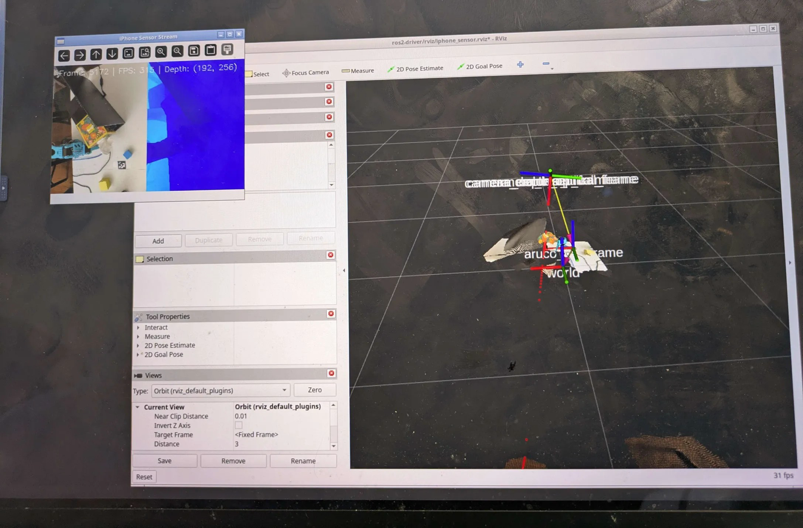

# Record3DStream

Use an iPhone as a full sensor suite (LiDAR RGBD, IMU, confidence) for robotics and spatial computing. Stream to Python or ROS2 over WiFi or USB.

## Attribution

This project is based on the original work by **Danqing Zhang** and the [PathOn-AI](https://github.com/PathOn-AI) team, published in the [pathon_opensource](https://github.com/PathOn-AI/pathon_opensource) repository. The original license terms are preserved — see [LICENSE](LICENSE).

## iOS App

Download the free iOS streaming app:

[](https://apps.apple.com/app/id6761314229)

<p align="center">
  
  
</p>
<p align="center"><em>Left: app ready to stream. Right: streaming at 30fps with 1 client connected.</em></p>

## Architecture

<p align="center">
  
</p>

```
iPhone (iOS App)                          PC / Robot
┌────────────────────┐                   ┌──────────────────────────┐
│ ARKit captures:    │   WiFi / USB      │ Python SDK               │
│  - RGB image       │ ──────────────→   │  - Decode stream         │
│  - LiDAR depth     │   TCP stream      │                          │
│  - IMU data        │                   │ ROS2 Driver              │
│  - Camera params   │                   │  - PointCloud2           │
│  - Camera pose     │                   │  - LaserScan             │
│  - Confidence map  │                   │  - RGB + Depth images    │
└────────────────────┘                   │  - CameraInfo            │
                                         │  - IMU                   │
                                         │  - TF tree               │
                                         │                          │
                                         │ Calibration              │
                                         │  - ArUco marker pose     │
                                         │  - base → camera_link TF │
                                         └──────────────────────────┘
```

## Data Available

All data is delivered per-frame at 30fps over a TCP stream.

| Field | Type | Shape | Description |
|-------|------|-------|-------------|
| `frame.color` | `uint8` | `(1440, 1920, 3)` | BGR image from RGB camera |
| `frame.depth` | `float32` | `(192, 256)` | LiDAR depth in metres |
| `frame.confidence` | `uint8` | `(192, 256)` | ARKit depth confidence: 0=low, 1=medium, 2=high *(Protocol v2)* |
| `frame.imu.accel` | `float64` | `(3,)` | Accelerometer x/y/z in m/s² *(Protocol v2)* |
| `frame.imu.gyro` | `float64` | `(3,)` | Gyroscope x/y/z in rad/s *(Protocol v2)* |
| `frame.intrinsics` | — | — | Camera intrinsics: `fx`, `fy`, `ppx`, `ppy`, `width`, `height` |
| `frame.transform` | `float32` | `(4, 4)` | ARKit camera-to-world pose matrix |
| `frame.frame_id` | `int` | — | Sequential frame counter |
| `frame.timestamp` | `float` | — | Seconds since stream start |

### Convenience methods on `Frame`

| Method | Returns | Description |
|--------|---------|-------------|
| `get_aligned_depth()` | `(1440, 1920)` float32 | Depth upscaled to RGB resolution via INTER_NEAREST |
| `get_depth_mm()` | `(192, 256)` uint16 | Depth converted to millimetres |
| `get_depth_intrinsics()` | `Intrinsics` | Intrinsics scaled to depth resolution |

### Image resolution

Resolutions are fixed by ARKit on the iPhone side and cannot be changed from the client:

- **RGB**: 1920 × 1440 (JPEG-compressed over the wire)
- **Depth / Confidence**: 256 × 192 (float32 / uint8)

> Depth and RGB share the same optical centre — they are already aligned in the ARKit coordinate frame, so no extrinsic calibration between the two sensors is needed.

## Project Structure

```
├── sdk/            # Python client library + examples
├── ros2-driver/    # ROS2 Jazzy package
└── calibration/    # ArUco-based camera-to-robot calibration
```

## Prerequisites

- **iPhone**: iPhone 12 Pro or newer (LiDAR) running the iOS streaming app
- **Python**: 3.10+ (any OS for Python-only usage)
- **ROS2**: Jazzy on Ubuntu (for ROS2 usage)
- **USB mode** (optional): `brew install libimobiledevice` (macOS) or `sudo apt install libimobiledevice-utils libusbmuxd-tools` (Linux)

## Quick Start

### 1. Launch the iOS App

Open the app on your iPhone. The **server IP address** is shown on screen.

### 2. Python SDK

```bash
cd sdk
python3 -m venv venv
source venv/bin/activate
pip install -e ".[visualization]"
```

#### Simple viewer (RGB + depth + sensor overlay)

```bash
python examples/simple_viewer.py <IPHONE_IP>       # WiFi
python examples/simple_viewer.py --usb             # USB
```

The viewer displays RGB and depth side-by-side, scaled to fit your screen, with a live overlay showing:

- **Frame ID** and **timestamp**
- **Camera intrinsics** — `fx`, `fy`, `cx`, `cy` at RGB resolution
- **IMU** — accelerometer (m/s²) and gyroscope (rad/s) *(Protocol v2 only)*
- **Camera pose** — position and rotation matrix from ARKit

| Key | Action |
|-----|--------|
| `Q` | Quit |
| `S` | Save current frame (`_color.jpg`, `_depth.png`, `_transform.npy`) |

#### Other examples

```bash
# Open3D interactive point cloud
python examples/point_cloud.py <IPHONE_IP>

# Test Protocol v2 features (confidence, IMU)
python examples/test_v2.py <IPHONE_IP>
```

#### Minimal Python usage

```python
from sdk import IPhoneSensorClient

client = IPhoneSensorClient('192.168.1.100')
client.start()

while True:
    frame = client.wait_for_frame()
    if frame:
        print(frame.depth.shape)      # (192, 256)
        print(frame.color.shape)      # (1440, 1920, 3)
        if frame.imu:
            print(frame.imu.accel)    # [x, y, z] m/s²

client.stop()
```

### 3. ROS2 Driver

#### Build

```bash
cd ros2-driver
python3 -m venv --system-site-packages venv
source venv/bin/activate
pip install "numpy<2" -e ../sdk -e .

source /opt/ros/jazzy/setup.bash
cd ..
colcon build --packages-select ros2_driver --symlink-install
```

#### Run

**Terminal 1 — ROS2 node**

```bash
export ROS_DOMAIN_ID=50
source /opt/ros/jazzy/setup.bash
source ros2-driver/venv/bin/activate

# WiFi
python3 -m ros2_driver.iphone_sensor_node --ros-args -p host:=<IPHONE_IP>

# USB
python3 -m ros2_driver.iphone_sensor_node --ros-args -p usb:=true
```

**Terminal 2 — RViz2**

```bash
export ROS_DOMAIN_ID=50
source /opt/ros/jazzy/setup.bash
rviz2 -d ros2-driver/rviz/iphone_sensor.rviz
```

### 4. Calibration

Print an ArUco marker (DICT_6X6_250, ID 3, 3.8 cm) and align its axes with the robot base frame.

```bash
python3 -m calibration.camera_calibration
```

See [calibration/README.md](calibration/README.md) for details.

## ROS2 Topics

| Topic | Type | Rate | Description |
|-------|------|------|-------------|
| `color/image_raw` | `sensor_msgs/Image` | 30fps | BGR8, 1920×1440 |
| `color/camera_info` | `sensor_msgs/CameraInfo` | 30fps | RGB intrinsics |
| `depth/image_rect_raw` | `sensor_msgs/Image` | 30fps | 32FC1 metres, 256×192 |
| `depth/camera_info` | `sensor_msgs/CameraInfo` | 30fps | Depth intrinsics |
| `aligned_depth_to_color/image_raw` | `sensor_msgs/Image` | ~6fps | Depth at RGB resolution |
| `depth/color/points` | `sensor_msgs/PointCloud2` | ~6fps | Coloured point cloud |
| `confidence/image_raw` | `sensor_msgs/Image` | 30fps | Mono8 confidence (0/1/2) |
| `imu` | `sensor_msgs/Imu` | 30fps | Accelerometer + gyroscope |
| `scan` | `sensor_msgs/LaserScan` | 30fps | 2D slice from depth middle row |

QoS: **BEST_EFFORT**, **VOLATILE**, **KEEP_LAST(1)** — set RViz2 Reliability Policy to *Best Effort*.

TF tree: `world` → `camera_link` → `camera_color_optical_frame` / `camera_depth_optical_frame`

## ROS2 Parameters

| Parameter | Default | Description |
|-----------|---------|-------------|
| `host` | `192.168.1.100` | iPhone IP (WiFi mode) |
| `port` | `8888` | TCP port |
| `usb` | `false` | USB mode via iproxy |
| `camera_name` | `camera` | Topic/TF prefix |
| `publish_pointcloud` | `true` | Enable PointCloud2 |
| `publish_aligned_depth` | `true` | Enable aligned depth |
| `publish_confidence` | `true` | Enable confidence map |
| `publish_imu` | `true` | Enable IMU topic |
| `publish_scan` | `true` | Enable LaserScan |
| `depth_range_min` | `0.1` | Min depth in metres |
| `depth_range_max` | `5.0` | Max depth in metres |
| `min_confidence` | `1` | Min ARKit confidence for point cloud (0/1/2) |

## How iPhone LiDAR Works

The iPhone LiDAR is a dToF (direct Time-of-Flight) flash sensor. ARKit processes the raw data through three pipelines:

| Pipeline | Output | Used here |
|---|---|---|
| Depth — LiDAR + RGB + ML | `sceneDepth` 256×192 depth image | Yes |
| Scene Mesh — accumulated LiDAR | `ARMeshAnchor` triangle mesh | Not yet |
| Body Tracking — RGB + Neural Engine | `ARBodyAnchor` skeleton joints | Not yet |

## License

This software is distributed under the terms of the [Restricted Use License](LICENSE) originally authored by Danqing Zhang. Individual and academic use is permitted; commercial use and redistribution require written permission from the copyright holder.
