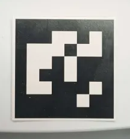
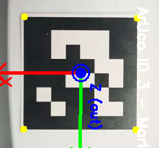

# Calibration — ArUco-Based Camera Calibration

Calibrate an iPhone camera's position relative to a known reference point using an ArUco marker. Establishes the TF chain:

```
world → aruco_tag_frame → camera_link
```

The `world` frame is a fixed reference frame you define (e.g., a table corner, a robot base, or any known location). The calibration finds the camera's position relative to this reference via the ArUco marker.

## How It Works

1. Place an ArUco marker at a **known, measured position** relative to your reference frame (`world`)
2. Run `camera_calibration.py` — it detects the marker via the iPhone camera stream
3. Collects 100 pose samples, averages them, and publishes the result as a static TF
4. Remove the marker — the calibration persists as long as the node is running

 

## Prerequisites

- **iPhone** streaming via the ROS2 driver (see [ros2-driver README](../ros2-driver/README.md))
- **ArUco marker** printed and placed in camera view
- **Python packages**: `opencv-python`, `numpy`, `scipy`, `rclpy`, `cv_bridge`, `tf2_ros`

### ArUco Marker Specs

| Property | Value |
|---|---|
| Dictionary | `DICT_6X6_250` |
| ID | 3 |
| Physical size | 3.8 cm (black square edge-to-edge) |

### Marker Orientation

The marker must be placed flat on the table with its axes aligned to your reference frame:
- Marker **X-axis** (left to right edge) aligned with **+X** (forward)
- Marker **Y-axis** (bottom to top edge) aligned with **+Y** (left)

Use `aruco_visualizer.py` to verify the axes look correct before calibrating.

## Usage

You need three terminals.

### Terminal 1: Start the iPhone Sensor ROS2 Node

```bash
export ROS_DOMAIN_ID=50
source /opt/ros/jazzy/setup.bash
source ros2-driver/venv/bin/activate
python3 -m ros2_driver.iphone_sensor_node --ros-args -p host:=<IPHONE_IP>
```

### Terminal 2: Start RViz2

```bash
## if using noVNC
export DISPLAY=:5
export ROS_DOMAIN_ID=50
source /opt/ros/jazzy/setup.bash
rviz2 -d ros2-driver/rviz/iphone_sensor.rviz
```

### Terminal 3: Run Calibration

#### 1. Measure the marker position

Measure the distance from the **center of your reference point** (`world` frame) to the **center of the ArUco marker** in meters. Use ROS convention: X = forward, Y = left, Z = up.

Edit the constants at the top of `camera_calibration.py`:

```python
TAG_X = -0.10   # meters, +X = forward from world origin
TAG_Y = -0.27   # meters, +Y = left from world origin
TAG_Z = 0.0     # meters, +Z = up from world origin
```

You can verify alignment by publishing a test static transform and checking in RViz:

```bash
export ROS_DOMAIN_ID=50
source /opt/ros/jazzy/setup.bash
ros2 run tf2_ros static_transform_publisher \
  --x -0.10 --y -0.27 --z 0.0 \
  --qx 0 --qy 0 --qz 0 --qw 1 \
  --frame-id world --child-frame-id aruco_tag_frame
```

The `aruco_tag_frame` should land exactly on the marker center in the point cloud.

#### 2. Run calibration

```bash
export ROS_DOMAIN_ID=50
source /opt/ros/jazzy/setup.bash
python3 -m calibration.camera_calibration
```

Expected output:

```
[INFO] Published static TF: world → aruco_tag_frame (x=-0.1, y=-0.27, z=0.0)
[INFO] Camera calibration started. Place ArUco marker (ID 3) in camera view. Collecting 100 samples...
[INFO] Got intrinsics: fx=906.7, fy=905.7
[INFO] Calibrating... 1/100
[INFO] Calibrating... 50/100
[INFO] Calibrating... 100/100

========================================
  CALIBRATION COMPLETE!
========================================
  aruco_tag_frame → camera_link:
    Translation: x=..., y=..., z=...
    Quaternion:  x=..., y=..., z=..., w=...

  TF chain: world → aruco_tag_frame → camera_link
  Marker can now be removed.
  Keep this node running to maintain the TF.
========================================
```

After calibration completes, remove the marker. **Keep the node running** to maintain the static TF.

#### 3. (Optional) Debug with the visualizer

To verify ArUco detection is working before running calibration:

```bash
python3 aruco_visualizer.py
```

This opens a live OpenCV window showing the detected marker with 3D axes and prints the pose values. Press `q` to quit.

## Configuration

Edit the constants at the top of `camera_calibration.py`:

| Constant | Default | Description |
|---|---|---|
| `ARUCO_DICT` | `DICT_6X6_250` | OpenCV ArUco dictionary |
| `MARKER_ID` | `3` | ID of the marker to detect |
| `MARKER_SIZE` | `0.038` | Marker size in meters |
| `TAG_X, TAG_Y, TAG_Z` | `-0.10, -0.27, 0.0` | Marker position relative to world origin (meters) |
| `CALIBRATION_COUNT` | `100` | Number of samples to average |

If using a different marker, update `MARKER_ID` in both `camera_calibration.py` and `aruco_visualizer.py`.

## Files

| File | Description |
|---|---|
| `camera_calibration.py` | Main calibration script — detects marker, averages 100 samples, publishes static TF chain |
| `aruco_visualizer.py` | Debug tool — live view of ArUco detection with 3D axes overlay |
| `dictionary_id.py` | Utility to identify which ArUco dictionary an unknown marker belongs to |
| `../docs/images/iphone_aruco.png` | Reference photo of the ArUco marker |
| `../docs/images/iphone_aruco_orientation.png` | Reference photo showing marker axis orientation |

## Troubleshooting

**"ArUco marker not detected"**: Make sure the marker is fully visible, well-lit, and not too far from the camera. Verify the correct `MARKER_ID` and `ARUCO_DICT` using `dictionary_id.py`.

**"No image" / node hangs**: The iPhone sensor ROS2 node must be running and publishing on `color/image_raw` and `color/camera_info`. Check with:
```bash
ros2 topic hz color/image_raw
```

**Calibration jitters or seems wrong**: Ensure the marker is stationary and the iPhone is held steady during calibration. Increase `CALIBRATION_COUNT` for more stability.

**Point cloud misaligned in RViz after calibration**: Double-check your `TAG_X/Y/Z` measurements. Even 1-2 cm error in physical measurement will propagate to the final TF.
